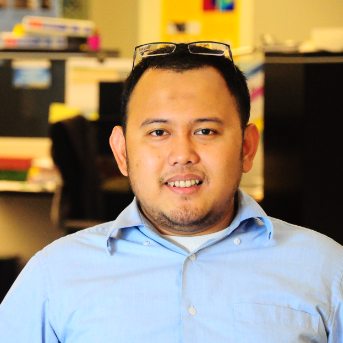

Hello, my name is Ditho. I am an Indonesian. My research interests are in the area of computational solid mechanics with special focus on damage modeling composite materials at micro-, meso-, and macro-scale, advanced material modeling including viscoelastic viscoplastic damage behavior of polymers, composites and metals. Currently, I am pursuing my Ph.D. from [Mechanical Engineering department](https://me.kaust.edu.sa) at [King Abdullah University of Science and Technology](http://kaust.edu.sa).

[You can view collection of my personal public repos and my forked repo here.](https://github.com/dithoap?tab=repositories)

## Contact details:

<dithoap@gmail.com>

23955-6900 King Abdullah University of Science and Technology, Thuwal, Makkah Province, Saudi Arabia
